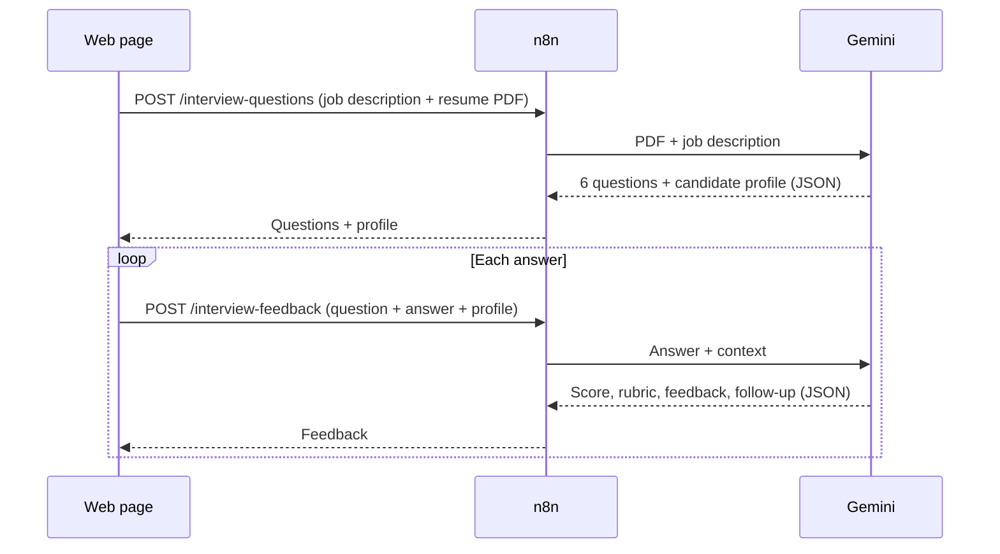

# Interview Prep Coach

A web tool for practicing job interviews. Paste a job description and upload a resume, and it generates the questions an interviewer would most likely ask. Answer each one and get a score, specific feedback, a stronger version of your answer, and a follow-up question to practice next.

The frontend is a single HTML page; the AI work runs in an n8n workflow powered by Google Gemini. It is the companion to [Resume Fit Analyzer](https://github.com/albertocj1/Resume-Fit-Analysis-App).

**Live demo:** https://albertocj1.github.io/Interview-Prep-Coach/

## What it does

1. **Generates 6 tailored questions** in a realistic interview order:
   - 1 role-fit and 1 behavioral question to warm up
   - 2 technical questions on the role's core skills
   - 2 gap questions that probe requirements the resume doesn't clearly show
2. **Explains each question.** Every question shows why an interviewer asks it, with optional hints on what a strong answer covers.
3. **Scores every answer** out of 10 against a fixed rubric, with what worked, what to improve, and a stronger version written only from the candidate's real experience.
4. **Asks follow-ups** the way a real interviewer would, so you can practice a full thread on one topic.
5. **Summarizes the session** with your average score, a per-question breakdown, and a shortcut to practice your weakest answers.

## How it works



### Multi-turn without a database

The resume PDF is uploaded once. The first call returns a short `candidate_profile` summarizing the resume, and the page keeps it in memory along with the questions. Each feedback request sends the profile, the question, and the answer, plus the previous exchange when answering a follow-up. Every request is self-contained, so the workflow needs no database or session storage, and follow-up calls are fast and cheap because they carry text instead of the PDF.

### Model fallback

Each webhook calls a primary Gemini model first. If the call fails after a retry, the same request goes to a lighter fallback model. Both are set in each chain's **Config** node. If both fail, the workflow returns an `error` message that the page displays.

## Scoring rubric

Each answer is scored from 1 to 5 on four criteria, which inform the overall score out of 10.

| Criterion | What it checks |
|---|---|
| Relevance | Does the answer address what was actually asked? |
| Specific examples | Concrete tools, numbers, and results instead of general claims |
| Structure | Clear flow; for experience questions, situation, task, action, result |
| Honesty | Claims match the resume; gap answers acknowledge the gap and show a plan |

| Score | Verdict |
|---|---|
| 9–10 | Strong |
| 7–8 | Good |
| 5–6 | Needs work |
| 1–4 | Weak |

## Works with Resume Fit Analyzer

Both tools are hosted on `albertocj1.github.io`, so they share browser storage. After a fit analysis, the **Practice the gaps** button in Resume Fit Analyzer saves the job description and missing skills, then opens this coach. The coach fills in the job description automatically and tells Gemini to focus the gap questions on those missing skills. The saved data is removed as soon as the coach reads it.

## Tech stack

- **Frontend:** HTML, CSS, and vanilla JavaScript (no build step)
- **Workflow:** n8n (Webhook, Code, Set, HTTP Request, Respond to Webhook nodes)
- **AI model:** Google Gemini via the Generative Language API, with structured JSON output and a Lite model fallback
- **Hosting:** GitHub Pages

## Project structure

```
Interview-Prep-Coach/
├── index.html                            # The web page
├── sample-resume.pdf                     # Fictional resume for the "Try a sample" button
├── interview-prep-coach-workflow.json    # n8n workflow to import
└── README.md
```

## Setup

### 1. Set up the n8n workflow

1. In n8n, go to **Workflows → Import from File** and select `interview-prep-coach-workflow.json`.
2. Open the four Gemini HTTP Request nodes (**LLM** and **LLM Fallback** in each chain) and select your **Google Gemini (PaLM) API** credential. You can get an API key from [Google AI Studio](https://aistudio.google.com/).
3. Optionally, change the `model` and `fallback_model` values in both **Config** nodes.
4. In both Webhook nodes, set **Allowed Origins** to your site's address (for example `https://albertocj1.github.io`).
5. Activate the workflow and copy both webhooks' **Production URLs**.

### 2. Connect the page

Open `index.html` and set the two endpoints near the top of the script:

```js
const QUESTIONS_ENDPOINT = "https://your-n8n-instance/webhook/interview-questions";
const FEEDBACK_ENDPOINT  = "https://your-n8n-instance/webhook/interview-feedback";
```

If both are left empty, the page runs on built-in sample data so you can preview the design without a backend.

### 3. Deploy

1. Push the files to a public GitHub repository.
2. Go to **Settings → Pages**, set the source to **Deploy from a branch**, and choose `main` and `/ (root)`.
3. The site will be live at `https://YOUR-USERNAME.github.io/Interview-Prep-Coach/` within a few minutes.

## API reference

Both endpoints accept `POST` requests as `multipart/form-data`. Object and array fields are sent as JSON strings.

### `/interview-questions`

| Field | Type | Description |
|---|---|---|
| `job_description` | text | Full job posting |
| `resume` | file | Resume in PDF format (up to 5 MB) |
| `focus_gaps` | JSON array (optional) | Skills to target in gap questions, e.g. `["AWS", "2+ years experience"]` |

```json
{
  "role_title": "Automation Engineer (Mid-level)",
  "candidate_profile": "Junior automation developer with about 1.5 years of experience...",
  "questions": [
    {
      "id": 1,
      "type": "behavioral",
      "question": "Tell me about a time an automation you built failed in production.",
      "why_asked": "To see how you handle ownership, debugging, and prevention.",
      "good_answer_covers": ["The failure and its impact", "How you found the cause", "What you changed"]
    }
  ],
  "model": "gemini-3.5-flash"
}
```

`type` is one of `gap`, `technical`, `behavioral`, or `role-fit`.

### `/interview-feedback`

| Field | Type | Description |
|---|---|---|
| `job_description` | text | Full job posting |
| `candidate_profile` | text | Profile returned by `/interview-questions` |
| `question` | JSON object | `{ "type", "question", "good_answer_covers" }` |
| `answer` | text | The candidate's answer |
| `previous` | JSON object (optional) | `{ "question", "answer" }` for the earlier exchange when answering a follow-up |

```json
{
  "score": 7,
  "verdict": "Good",
  "rubric": { "relevance": 4, "specificity": 3, "structure": 4, "honesty": 5 },
  "strengths": ["Clear example from a real project."],
  "improvements": ["Name a measurable result, such as hours saved."],
  "improved_answer": "In my current role I own 14 n8n workflows that...",
  "follow_up_question": "How did you decide which failures should alert you immediately?",
  "model": "gemini-3.5-flash"
}
```

On failure, either endpoint returns `{ "error": "..." }`.

## Security notes

- The Gemini API key is stored as an n8n credential and never appears in the page or this repository.
- The webhook URLs are visible in the page source. Restrict **Allowed Origins** to your domain and set a usage cap on your Gemini API key to prevent misuse.
- Session data (questions, answers, and scores) is held in the page's memory and cleared when the tab closes. Resumes and answers are sent to Gemini for analysis.

## Limitations

- Only PDF resumes are accepted. Word files need to be exported to PDF first.
- Answers are typed, not spoken, so the tool practices content and structure rather than delivery.
- Scores and feedback are AI-generated and meant for practice, not as a prediction of interview results.

## Author

**Christian Joshua Alberto**
Portfolio: [cjalberto.vercel.app](https://cjalberto.vercel.app)

© 2026 Christian Joshua Alberto. All rights reserved.
